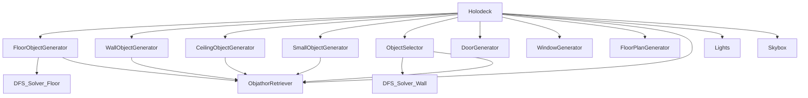

```mermaid
graph TD;
    A[Holodeck] --> B[FloorObjectGenerator]
    A --> C[WallObjectGenerator]
    A --> D[CeilingObjectGenerator]
    A --> E[SmallObjectGenerator]
    A --> F[ObjectSelector]
    A --> G[DoorGenerator]
    A --> H[WindowGenerator]
    A --> I[FloorPlanGenerator]
    A --> J[ObjathorRetriever]
    A --> K[Lights]
    A --> L[Skybox]
    B --> M[DFS_Solver_Floor]
    F --> N[DFS_Solver_Wall]
    F --> J
    B --> J
    C --> J
    D --> J
    E --> J
```
